[TOC]
# Graphviz: 可视化调试利器
当你的各种树出现奇奇怪怪的问题时，你是如何找到错误的呢？
`printf`？GDB？肉眼？
当然这些方法当然可行，然而把它画出来岂不更秒？
现在祭出利器：Graphviz

## 简介
> Graphviz is open source graph visualization software. Graph visualization is a way of representing structural information as diagrams of abstract graphs and networks. It has important applications in networking, bioinformatics,  software engineering, database and web design, machine learning, and in visual interfaces for other technical domains. 
> 

翻译：
> Graphviz是一个开源的图形可视化软件。图形可视化是表示诸如图表的结构化的抽象图形或网络。在网络技术、生物信息学、软件工程、数据库、网页设计、机器学习和可视化界面及其他可以领域大有用处。

详情参见[Graphviz官网](http://www.graphviz.org/)。

## 安装
这个不是本文的重点。我只知道对于Debian/Ubuntu用户可以按照以下方式安装：
```shell
sudo apt-get install graphviz
```

## 使用
Graphviz使用一种领域特定语言(<strong>D</strong>omain-<strong>S</strong>pecific <strong>L</strong>anguage[^dsl])来描述一副图。这里的图就是指图论中的图。然后Graphviz通过**自动布局器**来绘制出这个图。由于布局不是由我们手动决定的，因此生成的图的质量依赖于布局算法。

[^dsl]: 维基页面<https://en.wikipedia.org/wiki/Domain-specific_language>

大多数情况下，Graphviz的默认布局器`dot`可以胜任布局这一任务。下面我们将使用`dot`。

### Hello, GRAPHVIZ!
按照惯例，总得有个`Hello, world!`。
当然不要着急，我们先创建一个`dot`脚本文件：
```shell
touch hello-world.dot
```

用你喜欢的编辑器来编辑它：
```shell
vim hello-world.dot
```

写入以下内容，保存：
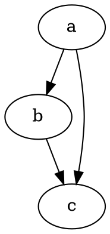

生成SVG图片：
```shell
dot hello-world.dot -Tsvg > hello-world.svg
```

用你喜欢的图片查看器来看看效果：
```shell
eog hello-world.svg
```

如果一路上不出意外，你可以看到下面的结果：


恭喜你成功创建了一张有向图。

### 图的类型
在上面，我们创建了一张带有三个顶点的有向图。然而我们有时候不一定要的就是有向图。
如果需要无向图，将`digraph`换为`graph`，并把有向边换为无向边即可：
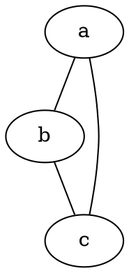

此时的图是这样的：


当然我们可以添加坑爹的平行边和自环：
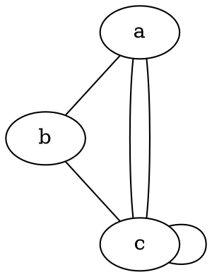

于是乎图长这样：


当然，如果你不想要它们出现，你可以利用`strict`将这张图变为严格的图：
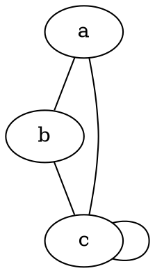

此时平行边已经不见了，毕竟它们的含义是一样的。但是自环还是会留下来的：


### 顶点
个人感觉椭圆实在太难看，用来调试完全体现不出B格。
把它换成圆形就好看多了：
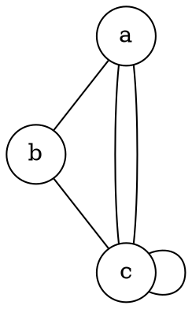

就变成这样：


> 啊！我想让`c`变成正方形！

当然也没有问题：
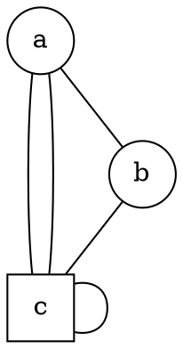


> 不行我要三角形！

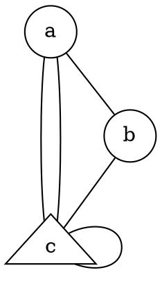


好吧如果你还要其它的图形，可以参见<http://www.graphviz.org/content/node-shapes>。

光有形状有卵用，加点颜色才好玩：
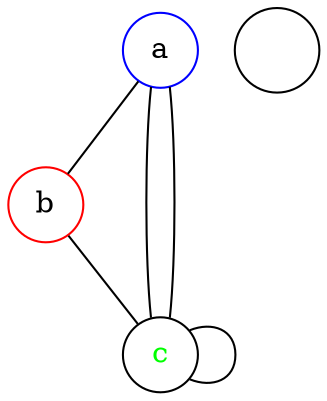


更详细的颜色名称表在此：<http://www.graphviz.org/content/color-names>

### 边
现在我们来画一棵二叉搜索树：
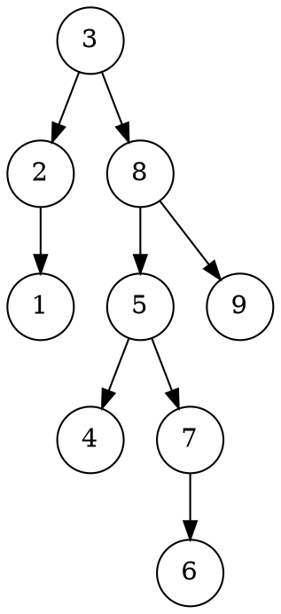

得到的结果是这样的：


似乎并不尽人意，难以分辨左儿子和右儿子。

因此我们可以通过顶点的方向来确定。
每个顶点有八个方向：
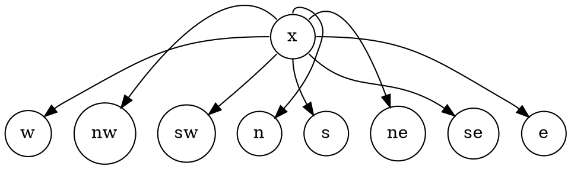
下面的图片展示了顶点的八个方向[^direction](这张图是用`circo`生成的，命令行参数一样)：


[^direction]: 事实上，Graphviz中可以定义更加更加精确的方向。但大多数情况下，这几个方向足矣。

这些方向和东南西北的表示是一样的。
刚才我们指定的是出发的方向，当然我们也可以指定进入的方向。

因此我们来将左右儿子的边的出发方向修改一下，左孩子出发方向为`:sw`，右孩子的出发方向为`:se`：
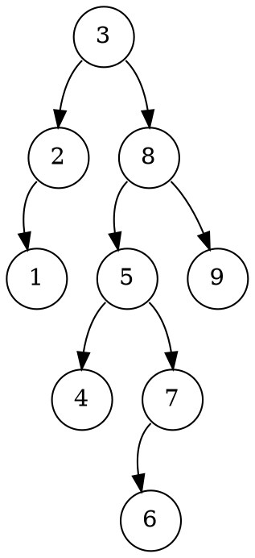


虽然不是那么规整，但是足以分辨出左右儿子了。

对于有些树，我们会记录父亲节点，因此我们加一条指向父亲的边：
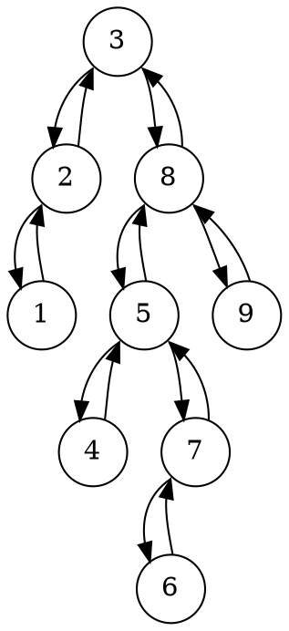
得到的效果是这样的：


> 话说我分不清哪个是指向父亲的链接了！！！

呃...没关系，我们把左右儿子的链接加粗就分得清了：
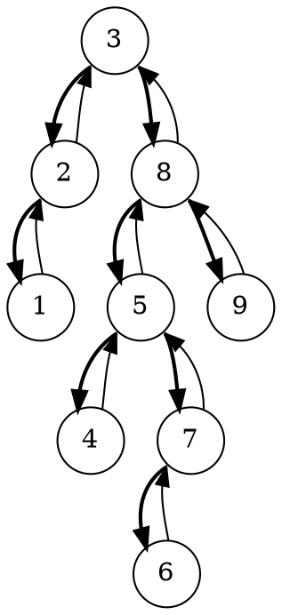

上面是对边进行设置，将边加粗。

> 指向区别能更明显些吗？

干脆把它做成虚的吧：
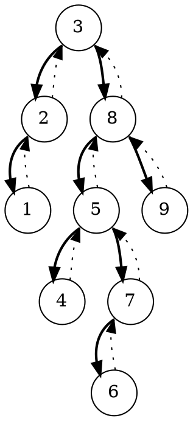


像某些数据结构，可能会有Lazy标记之类的，我们可能需要对节点作特殊标记来标明。
这当然也是可以实现的，只需提前声明好即可：
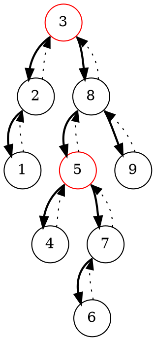


## 用于调试
经过上面的简单介绍，Graphviz已经可以用于调试了。
dot脚本非常的便于程序生成，因此我们可以在程序运行中途生成脚本，然后使用`dot`将其处理后并展示出来。
处理的代码大致是这个样子：
```
function SHOW(x):
    buffer = "graph {"
    
    // 读取数据并生成dot脚本
    
    buffer += "}"
    write buffer to a dot file
    SYSTEM "dot a.dot -Tsvg > a.svg && eog a.svg"
```

## 小结
Graphviz非常强大，这里只是介绍了一小部分功能，如想深入学习可以参见[Graphviz官方文档](http://www.graphviz.org/Documentation.php)或者[Graphviz中文教程指南](http://wenku.baidu.com/link?url=s6-k4YzEiR86S375YOPulP1wN8kYdq5UbzkMJsazP5HK7XFnjqZaaNQmzM7sDECAr47aGQReWpiI6Veu88IpK-MJmxxxo9dKGlGhCmRTns3)。

利用Graphviz我们可以将图论算法、数据结构的调试过程可视化，从而更加方便我们找到错误所在。

当然，可以利用Graphviz进行对算法过程的截图，从而生成整个算法的流程。

如果你想利用Graphviz来制作插图，那么自动布局就可能不能使你满意。此时个人推荐[ProcessOn](http://processon.com/)或者其它的**流程图**制作软件来绘制，效果更好。
